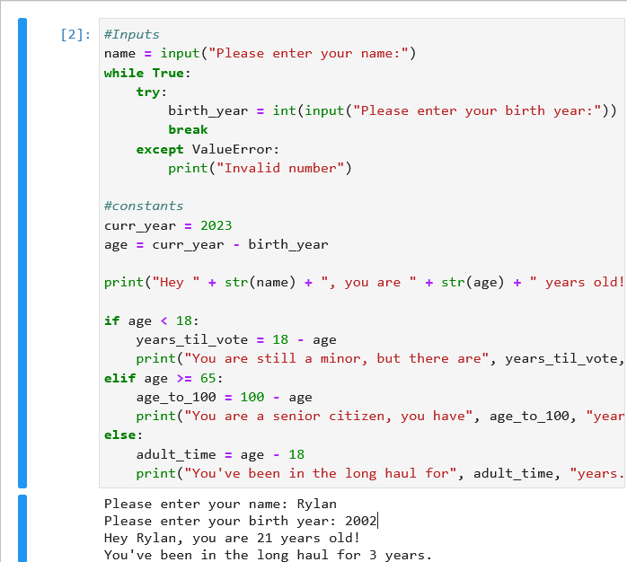

# Lab6/7-CMPINF0010
Skills lab 6/7 - Group 55

## Group Members

* Rylan Kauffman
* Max Lasky
* Aidan Barr Bono

# Repository Information

## What does the project do?

The included python file will take a name and birth year from the user and print their age. It will then output a unique description based on the user's age.

### EXAMPLE

.

## How to use

The python file is all that is needed and can simply be run on your own computer. Download the python file and then run it in a python interpreter. When it is running, enter text when the prompts indicate.

## How to contribute

Feel free to fork this repository to make changes. There should be a button for this on the top right of the page. Then once you make your changes to the program, you can submit a pull request and it will be reviewed.

## CODE-OF-CONDUCT and License

These were chosen to cover the basics when dealing with this project and are not custom made. The pages themselves will cover more details, but they should be adequate to protect both the owners and contributers to the repository.